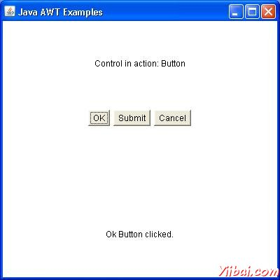

# AWT Button类 - AWT

## 介绍

按钮是一个控制组件，按下时有一个标签，并生成一个事件。当按钮被按下和释放，AWT发送ActionEvent的一个实例的按钮，通过调用按钮上的processEvent。按钮的processEvent方法接收所有事件的按钮，它通过一个动作事件以及调用其自身的processActionEvent方法。后一种方法通过操作事件的动作的已注册侦听此按钮所产生的动作事件。

如果一个应用程序需要一个按钮被按下和释放的基础上执行一些动作，但要实现ActionListener并注册新的侦听器接收事件从这个按钮，调用按钮的addActionListener方法。应用程序可以利用按钮的动作命令的消息传递协议。

## 类的声明

以下是声明的 java.awt.Button类：

```
public class Button
   extends Component
      implements Accessible
```

## 类的构造函数

| S.N. | 构造函数与说明 |
| --- | --- |
| 1 | **Button() ** Constructs a button with an empty string for its label. |
| 2 | **Button(String text) ** Constructs a new button with specified label. |

## 类方法

| S.N. | 方法和说明 |
| --- | --- |
| 1 | **void addActionListener(ActionListener l) ** Adds the specified action listener to receive action events from this button. |
| 2 | **void addNotify() ** Creates the peer of the button. |
| 3 | **AccessibleContext getAccessibleContext() ** Gets the AccessibleContext associated with this Button. |
| 4 | **String getActionCommand() ** Returns the command name of the action event fired by this button. |
| 5 | **ActionListener[] getActionListeners() ** Returns an array of all the action listeners registered on this button. |
| 6 | **String getLabel() ** Gets the label of this button. |
| 7 | **&lt;T extends EventListener&gt; T[] getListeners(Class&lt;T&gt; listenerType) ** Returns an array of all the objects currently registered as FooListeners upon this Button. |
| 8 | **protected String paramString() ** Returns a string representing the state of this Button. |
| 9 | **protected void processActionEvent(ActionEvent e) ** Processes action events occurring on this button by dispatching them to any registered ActionListener objects. |
| 10 | **protected void processEvent(AWTEvent e) ** Processes events on this button. |
| 11 | **void removeActionListener(ActionListener l) ** Removes the specified action listener so that it no longer receives action events from this button. |
| 12 | **void setActionCommand(String command) ** Sets the command name for the action event fired by this button. |
| 13 | **void setLabel(String label) ** Sets the button's label to be the specified string. |

## 继承的方法

这个类继承的方法从以下类：

*   java.awt.Component

*   java.lang.Object

## 按钮实例

选择使用编辑器创建以下java程序 D:/ &gt; AWT &gt; com &gt; yiibai.com &gt; gui &gt;

AwtControlDemo.java

```
package com.yiibai.gui;

import java.awt.*;
import java.awt.event.*;

public class AwtControlDemo {

   private Frame mainFrame;
   private Label headerLabel;
   private Label statusLabel;
   private Panel controlPanel;

   public AwtControlDemo(){
      prepareGUI();
   }

   public static void main(String[] args){
      AwtControlDemo  awtControlDemo = new AwtControlDemo();
      awtControlDemo.showButtonDemo();
   }

   private void prepareGUI(){
      mainFrame = new Frame("Java AWT Examples");
      mainFrame.setSize(400,400);
      mainFrame.setLayout(new GridLayout(3, 1));
      mainFrame.addWindowListener(new WindowAdapter() {
         public void windowClosing(WindowEvent windowEvent){
            System.exit(0);
         }        
      });    
      headerLabel = new Label();
      headerLabel.setAlignment(Label.CENTER);
      statusLabel = new Label();        
      statusLabel.setAlignment(Label.CENTER);
      statusLabel.setSize(350,100);

      controlPanel = new Panel();
      controlPanel.setLayout(new FlowLayout());

      mainFrame.add(headerLabel);
      mainFrame.add(controlPanel);
      mainFrame.add(statusLabel);
      mainFrame.setVisible(true);  
   }

   private void showButtonDemo(){
      headerLabel.setText("Control in action: Button"); 

      Button okButton = new Button("OK");
      Button submitButton = new Button("Submit");
      Button cancelButton = new Button("Cancel");

      okButton.addActionListener(new ActionListener() {
         public void actionPerformed(ActionEvent e) {
            statusLabel.setText("Ok Button clicked.");
         }
      });

      submitButton.addActionListener(new ActionListener() {
         public void actionPerformed(ActionEvent e) {
            statusLabel.setText("Submit Button clicked.");
         }
      });

      cancelButton.addActionListener(new ActionListener() {
         public void actionPerformed(ActionEvent e) {
            statusLabel.setText("Cancel Button clicked.");
         }
      });

      controlPanel.add(okButton);
      controlPanel.add(submitButton);
      controlPanel.add(cancelButton);       

      mainFrame.setVisible(true);  
   }
}
```

编译程序，使用命令提示符。到 **D:/ &gt; AWT **然后键入以下命令。

```
D:AWT>javac comyiibaiguiAwtControlDemo.java

```

如果没有错误出现，这意味着编译成功。使用下面的命令来运行程序。

```
D:AWT>java com.yiibai.gui.AwtControlDemo

```

验证下面的输出



