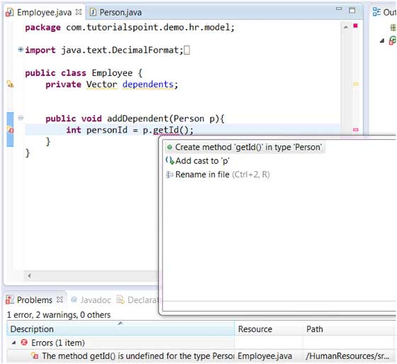
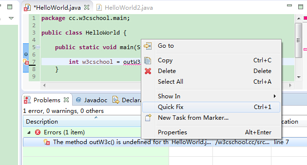

# Eclipse 快速修复

## 使用快速修复

在 Eclipse 编辑器中当你输入字母时，编辑器会对你输入的内容进行错误分析。

Java 编辑器中使用 Java 语法来检测代码中的错误。当它发现错误或警告时：

*   使用红色波浪线突出错误
*   使用黄色的波浪线突出警告
*   在 Problem 视图中显示错误和警告
*   在垂直标尺上显示黄色小灯泡及警告和错误标识

快速修复的对话框提供了解决的方案。快速修复对话框可通过以下方式调用：

*   将鼠标指针放在波浪线上
*   点击小灯泡
*   将鼠标指针放在突出的文本上并选择 Edit 菜单上的 Quick fix 项或者按下快捷键 Ctrl + 1

在上图中，getId 被高亮显示，因为 Person 类中没有一个名为的 getId() 方法。 在弹出的修复方案中选择 "Create method 'getId()' in type 'Person'" 这样就能在 Person 类中添加 getId() 方法。

也可以通过右键点击 Problems 视图中的错误项，然后选择快速修复菜单项显示的快速修复对话框，如下图所示：

  
