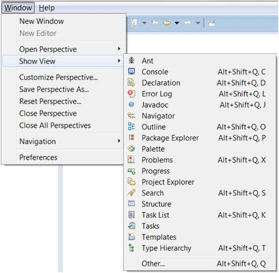
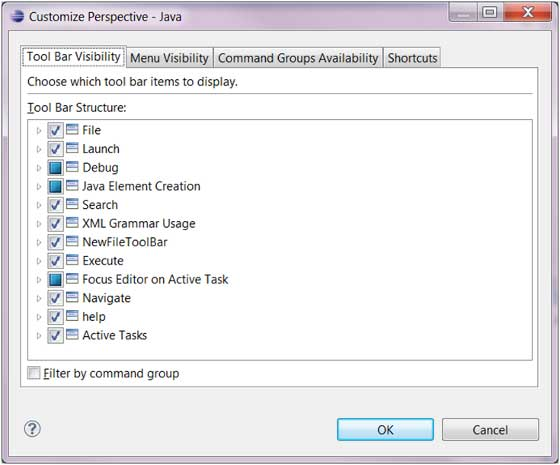

# Eclipse 视图

## 关于视图

Eclipse视图允许用户以图表形式更直观的查看项目的元数据。 例如，项目导航视图中显示的文件夹和文件图形表示在另外一个编辑窗口中相关的项目和属性视图。

Eclipse 透视图(perspective) 可以显示任何的视图和编辑窗口。

所有的编辑器实例出现在一个编辑器区域内，可以通过文件夹视图查看。

一个工作台窗口可以显示任意数量的文件夹视图。每个文件夹视图可以显示一个或多个视图。

## 组织视图

下图显示了文件夹视图的四个视图。

下图在两个文件夹视图中显示四个视图。

## 移除视图 views

视图从一个文件夹视图移动到另外一个文件夹视图只需要点击视图标题并推动视图工具区域到另外一个文件夹视图。

## 创建文件夹视图

文件夹视图可以通过移动视图标题栏到编辑去外或移动标题栏到另外一个文件夹视图来动态创建。 下图中如果你拖动了绿色线框内的标题栏意味着一个新的文件夹视图将被创建。

移动拖动图标到窗口的底部，您可以创建一个横跨窗口整个宽度的视图文件夹。移动拖动图标到窗口的左边或右边，您可以创建一个横跨窗口的整个高度视图文件夹。

## 操作视图

你可以在 Window 菜单中点击 "Show View" 选项打开其他视图。

点击 "Other" 菜单选项会弹出一个 "Show View" 对话框，对话框中你可以查找和激活视图。

视图通过各个分类来组织。你可以通过搜索框快速查找视图。 然后打开视图并选择，点击 "OK" 按钮即可。

## 什么是透视图？

透视图是一个包含一系列视图和内容编辑器的可视容器。默认的透视图叫 java。

Eclipse 窗口可以打开多个透视图，但在同一时间只能有一个透视图处于激活状态。

用户可以在两个透视图之间切换。

## 操作透视图

通过"Window"菜单并选择"Open Perspective &gt; Other"来打开透视图对话框。

透视图对话框中显示了可用的透视图列表。

该透视图列表也可以通过工具栏上的透视图按钮来打开 ( ) 。

## 视图切换

大都数情况下 java 开发者会使用 Java 透视图和 Debug 透视图。你可以通过工具条上的透视图名称来自由切换。

## 关闭透视图

工具条上右击透视图名及选择"Close"项即可关闭透视图。

## 自定义透视图

我们可以通过自定义透视图窗口来设置我们想要的透视图。

*   点击菜单栏上的 "Windows" =&gt; "Customize Perspective" =&gt; 弹出窗口，可以在"Submenus"里面选择你要设置的内容。
*   "New" =&gt; 设置你的新建菜单，可以把你平时需要新建的最常用的文件类型选中。
*   "Show Views" 在你自定义的这个视图的布局，也就是切换到你自己的视图后，会出现哪些窗口。根据自己习惯进行设置。
*   Open Perspective" =&gt; 切换视图菜单中，出现哪些可以选择的视图。
*   都设置好以后，保存你的自定义透视图。Windows =&gt; Save Perspective as，然后为你自定义的透视图取一个名字，保存。

   
