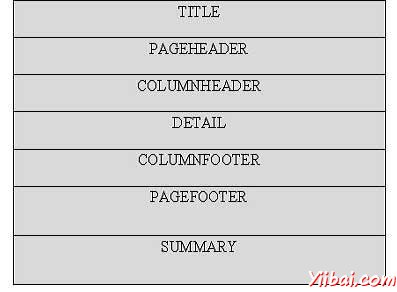

# JasperReports入门，JasperReports是什么？ - JasperReports教程

## 什么是报表

报表是从数据库中的数据有意义和良好汇总信息。通常情况下，日常活动是自动化和数据汇总到一个决策支持的格式“报告”。报表作为奇迹，当一般的杂乱数据转换成迷人的图表，图形和其他图形表示转换。

## 报表模板

一般有以下报表布局之后是许多商业报告生成工具来生成报告。

以下是图中提到的每个元件的描述。

| 元素 | 描述 |
| --- | --- |
| title | 标题包含该报告的标题。它只会出现一次，在报告的一开始，例如，“Yiibai教程报告”。 |
| pageHeader | PageHeader可能包含日期和时间的信息和/或组织的名称。这出现在每个页面的顶部。 |
| columnHeader | ColumnHeader列出了要在报表中显示，例如，“作者姓名”，“启动时间”，“完成时间”具体字段，“工作时间”和“日期”等的名称。 |
| detail | 详细信息在这里显示的特定字段（在的columnHeader列表）条目，例如部分"Manisha", "9:00", "18:00", "9", "10.02.2013". |
| columnFooter | ColumnFooter可以显示的任何字段的总和，例如，"Total Hours Worked: 180" |
| pageFooter | PageFooter可能包含页面计数信息。它出现在每个页面的底部，例如，"1/23". |
| summary | 摘要包含从“细节”部分推断出的信息，例如，工作小时为每个作者的数量列表，总工时为每个作者可以把视力表像饼图，曲线图等，为更好的比较。 |

## Jasper报表

报表开发过程中面临的常见故障归纳在以下几点：

*   核心变化：为了反映业务发生变化或改进它通常以改变报告的核心逻辑。

*   结果输出：有各种各样的格式，报表可导出到如：HTML，文本，PDF，MS Excel，RTF，ODT，逗号分隔值，XML或图像。

*   复杂报表：子报表和交叉表报告是很好的例子。

*   图表报表：视觉图为例。图，饼图，XY折线图，条形图，仪表和时间序列

为了消除上述点的开销，并促进报告过程中，很多框架，工具，库和第三方应用进行了介绍。Jasper Report 报表是其中之一。

Jasper Report 是一个开源的Java报表引擎，它不像其他的报表工具，例如Crystal报表是基于Java的，没有自己的表达式语法。JasperReports有提供丰富的内容到屏幕上，到打印机，或转换成PDF，HTML，XLS，RTF，ODT，CSV，TXT和XML文件的能力。因为它不是一个独立的工具，它不能被安装在其自身。相反，它是由包括它在应用程序的CLASSPATH库嵌入到Java应用程序。

JasperReports是一个Java类库，而不是针对最终用户，而是有针对性的对谁需要的报表功能添加到自己的应用程序的Java开发人员。

## JasperReports的特点

一些主要的 JasperReport 的功能包括：

*   具有灵活的报表布局。

*   它可以用文字或图形显示数据。

*   开发人员可以通过多种方式提供数据。

*   它可以接受来自多个数据源的数据。

*   它可以生成水印（水印是这样的方式被放置在主图像的副图像）

*   它可以生成子报表。

*   它能够导出报表到多种格式的。

