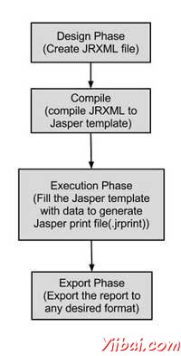

# JasperReport生命周期 - JasperReports教程

JasperReports的主要目的是为了在一个简单而灵活的方式创建页面为导向，准备好打印文档。下面的流程图描述了一个典型的工作流程，同时创建报表。

如在图片的生命周期具有以下明显的阶段

1.  [设计报表](http://www.yiibai.com/jasper_reports/jasper_report_designs.html)在这一步中，我们创建JRXML文件，该文件是包含的报表布局定义的XML文档。我们可以使用任何文本编辑器或iReportDesigner手动创建它。如果iReportDesigner使用的布局被设计成可视化的方式时，JRXML实际的结构可以被忽略。

2.  [编译报表](http://www.yiibai.com/jasper_reports/jasper_compiling_report_design.html) 在这一步中JRXML被编译为二进制对象称为Jasper文件(*.jasper)。做此编译是出于性能方面的考虑。Jasper文件是什么？它需要随应用程序以运行报表。

3.  [执行报表（数据填充到报表）](http://www.yiibai.com/jasper_reports/jasper_filling_reports.html) 在该步骤中从应用程序数据被填充在已编译的报表。类net.sf.jasperreports.engine.JasperFillManager提供了必要的功能，填补了报告中的数据。Jasper打印文件 (*.jrprint) 被创建，它可以用来打印或者导出报告。

4.  [导出报表到所需的格式](http://www.yiibai.com/jasper_reports/jasper_exporting_reports.html) 在这一步中，我们可以导出在上一步中使用JasperExportManager任何格式创建的Jasper打印文件。由于Jasper 提供各种形式的导出，因此具有相同的输入，我们可以创建数据的多种表示形式。

上述每个步骤的详细介绍将在以后的章节中解释。

