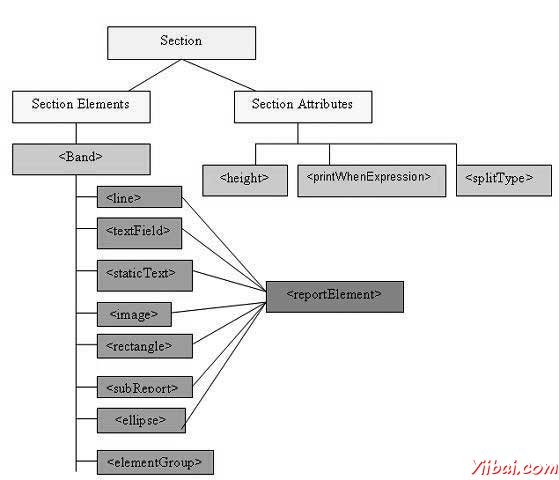
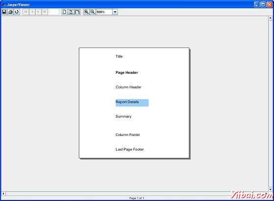

# JasperReports报表区段 - JasperReports教程

我们将在本章开始，一个简单的报表模板的结构看。依样画葫芦JasperReports的结构报表模板归类到多个区段。部分是有规定的高度，并且可以包含像直线，矩形，图像或文本字段对象报表的部分。

通过提供的报表数据源的虚拟记录的报表引擎遍历，在报表填充的时候。根据每个部分的定义的行为，引擎则呈现每个报表节在适当的时候。举例来说，细节部分的数据源中呈现为每个记录。当页中断，页眉和页面页脚节在需要时提供。

在JasperReports术语，报表区段也被称为报表带区。部分是由一个或多个频段。这些部分在报告生成时间反复填充并写在文件最后。

## 主要章节

在JasperReports报表模板主要有以下几个部分：

```
<title></title>
<pageheader></pageheader>
<columnheader></columnheader>
<groupheader></groupheader>
<detail></detail>
<groupfooter></groupfooter>
<columnfooter></columnfooter>
<pagefooter></pagefooter>
<lastpagefooter></lastpagefooter>
<summary></summary>
<nodata></nodata<>
<background></background>
```

下表总结了每个部分：

| Section | 描述 |
| --- | --- |
| Title | 本节中只出现一次在报表的开头。 |
| Page Header | 这部分出现在每一页的开头生成的文档中。 |
| Column Header | 这部分显示在生成的文档中的每一列的开头。如果报表只有一个定义列，那么列标题和脚注部分被忽略。 |
| Group Header | 这部分是由一个报告组（组章）引入。每次分组表达式改变其值，组页眉部分上面印的细节部分。在情况下，如果超过一个组被定义，组页眉打印在组定义的顺序。 |
| Detail | 这部分是重复的报表的数据源提供的数据的每一行。细节部分可以由多个频段。 |
| Group Footer | 这部分是由一个报告组（组章）引入。该组页脚节印下的分组表达式的值更改前的细节部分。组页脚始终打印在数据源的数据的最后一行。在情况下，如果超过一个组被定义，组页脚打印在组定义的顺序相反。 |
| Column Footer | 本节将出现在每一列的底部。如果报告的列数为1，则列标题和脚注部分被忽略。 |
| Page Footer | 本节出现在每个页面的底部。 |
| Last Page Footer | 这部分取代了报表的最后一页上的常规页页脚。在情况下，摘要部分也存在，那么这可能不是该文件的最后一页。这部分有时是有用的，当汇总信息具有在最后一页的底部显示。 |
| Summary | 本节中只出现一次在报告的末尾。 |
| No Data | 这部分被打印时，当无资料打印报表属性设置为无数据段。如果&lt;noData&gt;部在报告模板中定义，并且如果数据源是空的，那么&lt;noData&gt;部分将是唯一一个在填充时考虑，其含量将产生报表输出。 |
| Background | 背景部分会显示每一页上，并不能溢出到下一个页面。放在这一部分的元素在页面初始化的时候求值，并显示在背景中。所有其他的页面对象被显示在背景上对象的顶部。这部分是用于创建页面水印有用。 |

### 部分，元素和属性的关系

下图显示的元素和属性在报表中的部分关系。



## section元素

所有上述报表部分都是可选的。但任何报表模板将至少有一个这样的部分。每一节都包含一个单一的&lt;band&gt;元素作为其唯一的子元素。一个&lt;band&gt;可以包含零个或多个下列子元素：

<line>, <rectangle>, <ellipse>, <image>, <staticText>, <textField>, <subReport>, or <elementGroup>

这些元素都必须包含一个&lt;reportElement&gt;作为其第一个元素（除了elementGroup）。一个&lt;reportElement&gt;决定了数据是如何奠定了该特定元素。与变量和参数，不要求报表内容有一个名字，因为通常不需要获得一个报表模板内的任何单个元素。

下表总结了&lt;reportElement&gt;属性：

| 属性 | 描述 | 有效值 |
| --- | --- | --- |
| x | 指定频带元件的x坐标。 | 一个整数值，表示以像素为单位的元素的x坐标。此属性是必需的。 |
| y | 指定频带元件的y坐标。 | 一个整数值，表示在y以像素为元素的坐标。此属性是必需的。 |
| width | 指定频带元件的宽度。 | 一个整数值，表示该元素的宽度以像素为单位。此属性是必需的。 |
| height | 指定频带元件的高度。 | 一个整数值，表示以像素为元素的高度。此属性是必需的。 |
| key | 带元素的唯一标识符。 | 唯一字符串值。 |
| stretchType | 指定包含带延伸当元素如何延伸 | **NoStretch (default)**: 该元素不会延长。**RelativeToTallestObject**: 该元素将伸展以适应它的组的最高的对象。**RelativeToBand**: 该元素将延伸到适合带的高度。 |
| positionType | 指定当频带延伸元素的位置。 | **Float**: 元素将取决于周围元件的尺寸移动。**FixRelativeToTop (default)**: 该元素将保持一个固定的位置相对于带的顶部。**FixRelativeToBottom**: 该元素将保持一个固定的位置相对于带的底部。 |
| isPrintRepeatedValues | 如果指定的值重复打印。 | **true (default)**: 重复的值将被打印出来。**false**: 重复的值将不被打印出来。 |
| mode | 指定元素的背景模式 | 不透明的，透明的 |
| isRemoveLineWhenBlank | 如果指定了当它是空白，并有在相同的水平空间没有其他元素的元素应被删除。 | true, false |
| isPrintInFirstWholeBand | 如果指定的元素必须打印在整个频段，也就是说，未被报表的页面或列之间分割的波段。 | true, false |
| isPrintWhenDetailOverFlows | 指定是否当频带溢出到新页或列中的元素将被打印出来。 | true, false |
| printWhenGroupChanges | 指定在指定的组改变元素将被打印。 | string值 |
| forecolor | 指定元素的前景色。 | 无论前面加上＃字符，或以下预定义值中的一个十六进制RGB值：_black, blue, cyan, darkGray, gray, green, lightGray, magenta, orange, pink, red, yellow, white._ |
| backcolor | 指定元素的背景颜色。 | 同样作为有效值的前景色 |

## 段属性

以下是报表的部分属性：

### 高度

该部分的高度指定高度，该特定部分的像素，是非常重要的在整体报表设计。

### 打印当表达式

布尔表达式，确定该部分是否应打印或不打印。

### SPLIT ALLOWED

一个标志，指示该部分是否允许分裂时，它不适合在当前页面上。如果为true，该部分将被转移到下一个页面。注意，如果一节不适合下页上，那么将会考虑该标志的值的拆分。 splitType可以利用以下值：

*   splitType="Stretch" : 拆分拉伸内容。如果该部分在当前页上延伸（如果可用空间小于宣高度），这是添加到原始高度的区域是否允许分割到下页

*   splitType="Prevent" : 避免在第一次尝试分割。如果部分不适合在下一页中，分割通常发生，预防频带分割是有效的只有在第一次分割尝试。

*   splitType="Immediate" : 立即绘制。该频段允许的任何地方，除了分割高于其最顶端的元素。

## 例子

为演示开始每个部分让我们编写报表模板（jasper_report_template.jrxml）。将此文件保存到C: oolsjasperreports-5.0.1 est目录。在这个文件中，我们将显示在每个部分的文本（上面所讨论的）。该文件的内容如下所述：  

```
<?xml version="1.0" encoding="UTF-8"?>
<jasperReport xmlns="http://jasperreports.sourceforge.net/jasperreports"
xmlns:xsi="http://www.w3.org/2001/XMLSchema-instance"
xsi:schemaLocation="http://jasperreports.sourceforge.net/jasperreports
http://jasperreports.sourceforge.net/xsd/jasperreport.xsd"
name="jasper_report_template" pageWidth="300" pageHeight="300" columnWidth="300"
leftMargin="0" rightMargin="0" topMargin="0" bottomMargin="0" >

   <title>
      <band height="50">
         <textField>
            <reportElement x="100" y="16"
            width="100" height="20"/>
            <textElement/>
            <textFieldExpression>
               <![CDATA["Title"]]>
            </textFieldExpression>
         </textField>
      </band>
   </title>
   <pageHeader>
      <band height="40">
         <textField>
            <reportElement  mode="Opaque" x="100" y="10"
            width="90" height="20"/>
            <textElement>
               <font isBold="true"/>
            </textElement>
            <textFieldExpression>
               <![CDATA["Page Header"]]>
            </textFieldExpression>
         </textField>
      </band>
   </pageHeader>
   <columnHeader>
      <band height="40">
            <textField>
            <reportElement  x="100" y="10" width="90"
            height="20"/>
            <textElement>
               <font isItalic="true"/>
            </textElement>
            <textFieldExpression>
               <![CDATA["Column Header"]]>
            </textFieldExpression>
         </textField>
      </band>
   </columnHeader>
   <detail>
      <band height="40">
         <textField>
            <reportElement mode="Opaque" x="100" y="10" width="90"
            height="20" backcolor="#99CCFF"/>
            <textElement/>
            <textFieldExpression>
               <![CDATA["Report Details"]]>
            </textFieldExpression>
         </textField>
      </band>
   </detail>
   <columnFooter>
      <band height="40">
         <textField>
            <reportElement  x="100" y="10" width="90"
            height="20"/>
            <textElement/>
            <textFieldExpression>
               <![CDATA["Column Footer"]]>
            </textFieldExpression>
         </textField>
      </band>
   </columnFooter>
   <pageFooter>
      <band height="40">
         <textField>
            <reportElement  x="100" y="10"
            width="90" height="20"/>
            <textElement/>
            <textFieldExpression>
               <![CDATA["Page Footer"]]>
            </textFieldExpression>
         </textField>
      </band>
   </pageFooter>
   <lastPageFooter>
      <band height="40">
         <textField>
            <reportElement  x="100" y="10" width="90"
            height="20"/>
            <textElement/>
            <textFieldExpression>
               <![CDATA["Last Page Footer"]]>
            </textFieldExpression>
            </textField>
      </band>
   </lastPageFooter>
   <summary>
      <band height="40">
         <textField>
            <reportElement  x="100" y="10" width="90"
            height="20"/>
            <textElement/>
            <textFieldExpression>
               <![CDATA["Summary"]]>
            </textFieldExpression>
         </textField>
      </band>
   </summary>
</jasperReport>
```

java代码填写并生成报告如下。保存这个文件JasperReportFill.java 到 C: oolsjasperreports-5.0.1 estsrccomyiibai 目录.

```
package com.yiibai;

import net.sf.jasperreports.engine.JREmptyDataSource;
import net.sf.jasperreports.engine.JRException;
import net.sf.jasperreports.engine.JasperFillManager;

public class JasperReportFill {
   public static void main(String[] args) {
      String sourceFileName =
            "C://tools/jasperreports-5.0.1/test/" +
            "jasper_report_template.jasper";

      try {
         JasperFillManager.fillReportToFile(sourceFileName, null,
            new JREmptyDataSource());
      } catch (JRException e) {
         // TODO Auto-generated catch block
         e.printStackTrace();
      }

   }
}
```

在这里，我们填充报表时，以模拟一个数据源，在这一个记录使用JREmptyDataSource的实例，但与所有在这个单一记录为null的字段。

### 报表生成

将编译和执行使用常规Ant构建过程上面的文件build.xml文件中的内容（根据目录保存：C: oolsjasperreports-5.0.1 est）情况如下。(saved under directory C: oolsjasperreports-5.0.1 est) 如下.

```
<?xml version="1.0" encoding="UTF-8"?>
<project name="JasperReportTest" default="viewFillReport" basedir=".">
   <import file="baseBuild.xml" />
   <target name="viewFillReport"
      depends="compile,compilereportdesing,run"
      description="Launches the report viewer to preview
      the report stored in the .JRprint file.">
      <java classname="net.sf.jasperreports.view.JasperViewer"
      fork="true">
         <arg value="-F${file.name}.JRprint" />
         <classpath refid="classpath" />
      </java>
   </target>
   <target name="compilereportdesing"
      description="Compiles the JXML file and
      produces the .jasper file.">
      <taskdef name="jrc"
      classname="net.sf.jasperreports.ant.JRAntCompileTask">
         <classpath refid="classpath" />
      </taskdef>
      <jrc destdir=".">
         <src>
         <fileset dir=".">
            <include name="*.jrxml" />
         </fileset>
         </src>
         <classpath refid="classpath" />
      </jrc>
   </target>
</project>
```

接下来，让我们打开命令行窗口并转到build.xml文件放置的目录。最后执行的命令 **ant -Dmain-class=com.yiibai.JasperReportFill**（viewFullReport是默认的目标），如下所示：

```
C:    oolsjasperreports-5.0.1    est>ant -Dmain-class=com.yiibai.JasperReportFill
Buildfile: C:    oolsjasperreports-5.0.1    estuild.xml

clean-sample:
   [delete] Deleting directory C:    oolsjasperreports-5.0.1    estclasses
   [delete] Deleting: C:    oolsjasperreports-5.0.1    estjasper_report_template.jasper
   [delete] Deleting: C:    oolsjasperreports-5.0.1    estjasper_report_template.jrprint

compile:
    [mkdir] Created dir: C:    oolsjasperreports-5.0.1    estclasses
    [javac] C:    oolsjasperreports-5.0.1    estaseBuild.xml:28:
    warning: 'includeantruntime' was not set, defau
    [javac] Compiling 1 source file to C:    oolsjasperreports-5.0.1    estclasses

compilereportdesing:
      [jrc] Compiling 1 report design files.
      [jrc] log4j:WARN No appenders could be found for logger
      (net.sf.jasperreports.engine.xml.JRXmlDigesterFac
      [jrc] log4j:WARN Please initialize the log4j system properly.
      [jrc] log4j:WARN See http://logging.apache.org/log4j/1.2/faq.htmll#noconfig for more info.
      [jrc] File : C:    oolsjasperreports-5.0.1    estjasper_report_template.jrxml ... OK.

run:
     [echo] Runnin class : com.yiibai.JasperReportFill
     [java] log4j:WARN No appenders could be found for logger
     (net.sf.jasperreports.extensions.ExtensionsEnviro
     [java] log4j:WARN Please initialize the log4j system properly.

viewFillReport:
     [java] log4j:WARN No appenders could be found for logger
     (net.sf.jasperreports.extensions.ExtensionsEnviro
     [java] log4j:WARN Please initialize the log4j system properly.

BUILD SUCCESSFUL
Total time: 18 minutes 22 seconds

```

正如上文编译的结果，JasperViewer窗口打开如下面的屏幕：



在这里，我们可以在每个文本被打印的部分看到。但应当注意的是，作为JRXML包含&lt;lastPageFooter&gt;元件，它将被显示在报表，而不是所显示的&lt;pageFooter&gt;元素的最后一页。如果有多个列的&lt;columnHeader&gt;和&lt;columnFooter&gt;元素将只显示在报告中。

