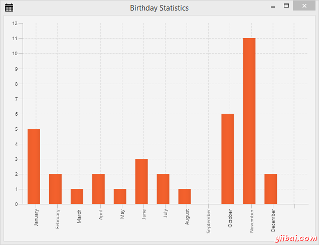
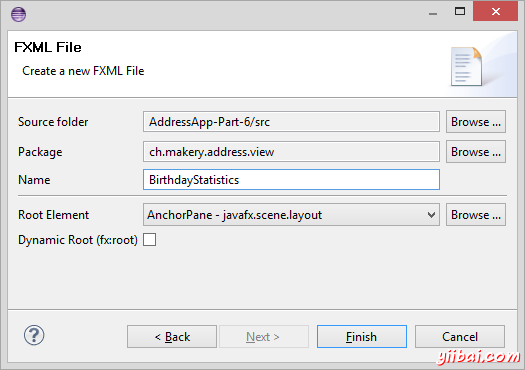

# JavaFX - 统计图 - JavaFX教程



## 第6部分的主题

*   创建一个统计图显示生日的分布。

## 生日统计

在AddressApp中所有人员都有生日。当我们人员庆祝他们生日的时候，如果有一些生日的统计不是会更好。

我们使用柱状图，包含每个月的一个条形。每个条形显示在指定月份中有多少人需要过生日。

## 统计FXML视图

1.  在`ch.makery.address.view`包中我们开始创建一个`BirthdayStatistics.fxml`(_右击包|New|other..|New FXML Document_) 

2.  在Scene Builder中打开`BirthdayStatistics.fxml`文件。

3.  选择根节点`AnchorPane`。在_Layout_组中设置_Pref Width_为620，_Pref Height_为450。

4.  添加`BarChart`到`AnchorPane`中。

5.  右击`BarChart`并且选择_Fit to Parent_。

6.  保存fxml文件，进入到Eclipse中，F5刷新项目。

在我们返回到Scene Builder之前，我们首先创建控制器，并且在我们的`MainApp`中准备好一切。

## 统计控制器

在view包 `ch.makery.address.view`中创建一个Java类，称为`BirthdayStatisticsController.java`。

在开始解释之前，让我们看下整个控制器类。

##### BirthdayStatisticsController.java

```
package ch.makery.address.view;

import java.text.DateFormatSymbols;
import java.util.Arrays;
import java.util.List;
import java.util.Locale;

import javafx.collections.FXCollections;
import javafx.collections.ObservableList;
import javafx.fxml.FXML;
import javafx.scene.chart.BarChart;
import javafx.scene.chart.CategoryAxis;
import javafx.scene.chart.XYChart;
import ch.makery.address.model.Person;

/**
 * The controller for the birthday statistics view.
 * 
 * @author Marco Jakob
 */
public class BirthdayStatisticsController {

    @FXML
    private BarChart<String, Integer> barChart;

    @FXML
    private CategoryAxis xAxis;

    private ObservableList<String> monthNames = FXCollections.observableArrayList();

    /**
     * Initializes the controller class. This method is automatically called
     * after the fxml file has been loaded.
     */
    @FXML
    private void initialize() {
        // Get an array with the English month names.
        String[] months = DateFormatSymbols.getInstance(Locale.ENGLISH).getMonths();
        // Convert it to a list and add it to our ObservableList of months.
        monthNames.addAll(Arrays.asList(months));

        // Assign the month names as categories for the horizontal axis.
        xAxis.setCategories(monthNames);
    }

    /**
     * Sets the persons to show the statistics for.
     * 
     * @param persons
     */
    public void setPersonData(List<Person> persons) {
        // Count the number of people having their birthday in a specific month.
        int[] monthCounter = new int[12];
        for (Person p : persons) {
            int month = p.getBirthday().getMonthValue() - 1;
            monthCounter[month]++;
        }

        XYChart.Series<String, Integer> series = new XYChart.Series<>();

        // Create a XYChart.Data object for each month. Add it to the series.
        for (int i = 0; i < monthCounter.length; i++) {
            series.getData().add(new XYChart.Data<>(monthNames.get(i), monthCounter[i]));
        }

        barChart.getData().add(series);
    }
}
```

#### 控制器如何工作

1.  控制器需要从FXML文件中访问两个元素:

    *   `barChar`：它有`String`和`Integer`类型。`String`用于x轴上的月份，`Integer`用于指定月份中人员的数量。
    *   `xAxis`：我们使用它添加月字符串
2.  `initialize()` 方法使用所有月的列表填充`x-axis`。

3.  `setPersonData(…)`方法将由`MainApp`访问，设置人员数据。它遍历所有人员，统计出每个月生日的人数。然后它为每个月添加`XYChart.Data`到数据序列中。每个`XYChart.Data`对象在图表中表示一个条形。

## 连接视图和控制器

1.  在Scene Builder中打开`BirthdayStatistics.fxml`。

2.  在Controller组中设置`BirthdayStatisticsController`为控制器。

3.  选择`BarChart`，并且选择`barChar`作为fx:id属性(在_Code_组中)

4.  选择`CategoryAxis`，并且选择`xAxis`作为fx:id属性。
    

5.  你可以添加一个标题给`BarChar`(在_Properties_组中)进一步修饰。

## 连接View/Controller和MainApp

我们为_生日统计_使用与_编辑人员对话框_相同的机制，一个简单的弹出对话框。

添加下面的方法到`MainApp`类中

```
/**
 * Opens a dialog to show birthday statistics.
 */
public void showBirthdayStatistics() {
    try {
        // Load the fxml file and create a new stage for the popup.
        FXMLLoader loader = new FXMLLoader();
        loader.setLocation(MainApp.class.getResource("view/BirthdayStatistics.fxml"));
        AnchorPane page = (AnchorPane) loader.load();
        Stage dialogStage = new Stage();
        dialogStage.setTitle("Birthday Statistics");
        dialogStage.initModality(Modality.WINDOW_MODAL);
        dialogStage.initOwner(primaryStage);
        Scene scene = new Scene(page);
        dialogStage.setScene(scene);

        // Set the persons into the controller.
        BirthdayStatisticsController controller = loader.getController();
        controller.setPersonData(personData);

        dialogStage.show();

    } catch (IOException e) {
        e.printStackTrace();
    }
}
```

一切设置完毕，但是我们没有任何东西实际上调用新的`showBirthdayStatistics()`方法。幸运的是我们已经在`RootLayout.fxml`中有一个菜单，它可以用于这个目的。

### 显示生日统计菜单

在`RootLayoutController`中添加下面的方法，它将处理_显示生日统计_菜单项的用户点击。

```
/**
 * Opens the birthday statistics.
 */
@FXML
private void handleShowBirthdayStatistics() {
  mainApp.showBirthdayStatistics();
}
```

现在，使用Scene Builder打开`RootLayout.fxml`文件。创建_Staticstic_ `菜单`，带有一个_Show Statistcs_ `MenuItem`:


选择_Show Statistics_ `MenuItem`，并且选择`handleShowBirthdayStatistics`作为`On Action`(在_Code_组中)。


进入到Eclipse，刷新项目，测试它。

## JavaFX Chart的更多信息

更多信息的一个好地方是官方Oracle教程，[使用JavaFX Chart](http://docs.oracle.com/javase/8/javafx/user-interface-tutorial/charts.html).

