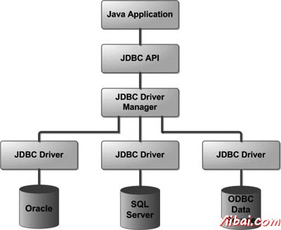

# JDBC4简介，JDBC是什么？ - JDBC教程

## JDBC是什么?

JDBC代表Java数据库连接，这对Java编程语言和广泛的数据库之间独立于数据库的连接标准的Java API。

JDBC库包含的API为每个通常与数据库的使用相关联的任务：

*   使得连接到数据库

*   创建SQL或MySQL语句

*   执行SQL或MySQL的查询数据库

*   查看和修改结果记录

从根本上说，JDBC是一种规范，它提供的接口，一套完整的，允许便携式访问底层数据库。可以用Java来写不同类型的可执行文件，如：

*   Java应用程序

*   Java Applets

*   Java Servlets

*   Java ServerPages (JSP)

*   Enterprise JavaBeans (EJBs)

所有这些不同的可执行文件就可以使用JDBC驱动程序来访问数据库，并把存储的数据的优势。

JDBC提供了相同的功能，ODBC，允许Java程序包含与数据库无关的代码。

## 先决条件：

以前正如期进行本教程，需要具备以下两个主题内容很好的了解：

*   [核心Java编程](http://www.yiibai.com/java/index.html)

*   [SQL或MySQL数据库](http://www.yiibai.com/mysql/index.html)

## JDBC架构：

JDBC API支持两层和三层处理模型进行数据库访问，但在一般的JDBC体系结构由两层组成：

*   JDBC API: 提供了应用程序对JDBC的管理连接。

*   JDBC Driver API: 支持JDBC管理到驱动器连接。

JDBC API的使用驱动程序管理器和数据库特定的驱动程序提供透明的连接到异构数据库。

JDBC驱动程序管理器可确保正确的驱动程序来访问每个数据源。该驱动程序管理器能够支持连接到多个异构数据库的多个并发的驱动程序。

以下是结构图，它显示了驱动程序管理器方面的JDBC驱动程序和Java应用程序的位置：

## 常见的JDBC组件：

JDBC API提供了以下接口和类：

*   DriverManager: 这个类管理数据库驱动程序的列表。内容是否符合从Java应用程序使用的通信子协议正确的数据库驱动程序的连接请求。识别[JDBC](http://www.yiibai.com/jdbc/)在一定子协议的第一个驱动器将被用来建立数据库连接。

*   Driver: 此接口处理与数据库服务器通信。很少直接与驱动程序对象。相反，使用DriverManager中的对象，它管理此类型的对象。它也抽象与驱动程序对象工作相关的详细信息

*   Connection : 此接口与接触数据库的所有方法。连接对象表示通信上下文，即，与数据库中的所有的通信是通过唯一的连接对象。

*   Statement : 可以使用这个接口创建的对象的SQL语句提交到数据库。一些派生的接口接受除执行存储过程的参数。

*   ResultSet: 这些对象保存从数据库后，执行使用Statement对象的[SQL](http://www.yiibai.com/sql/)查询中检索数据。它作为一个迭代器，让您可以通过移动它的数据。

*   SQLException: 这个类处理发生在一个数据库应用程序的任何错误。

## JDBC 4.0软件包

对JDBC4.0，java.sql和javax.sql是主要的包。这是最新版本的JDBC在写这篇教程的时候。它提供的主要类与数据源进行交互。

在这些包中的新功能包括改变在以下几个方面：

*   自动数据库驱动程序加载

*   异常处理的改进

*   增强的BLOB/ CLOB功能

*   连接和语句界面增强

*   国家字符集支持

*   SQL ROWID访问

*   SQL 2003 XML数据类型支持

*   注释

