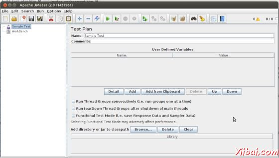
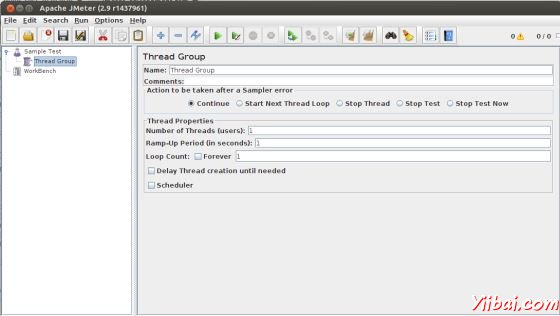
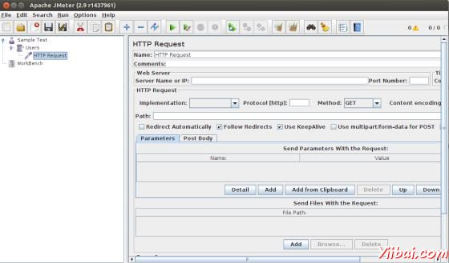
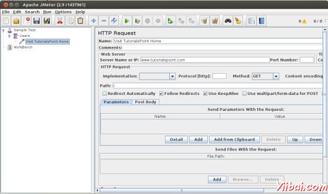
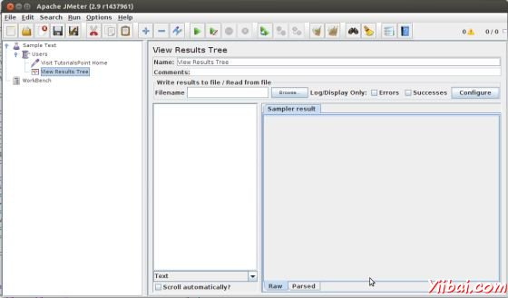
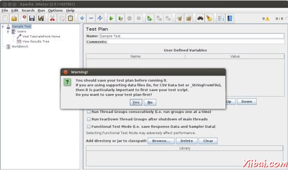
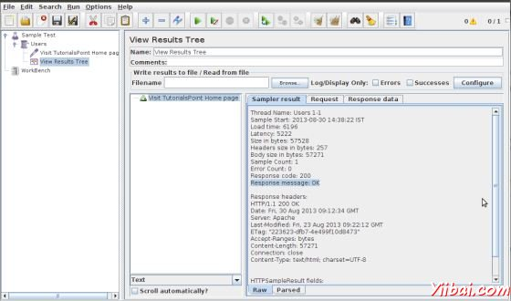
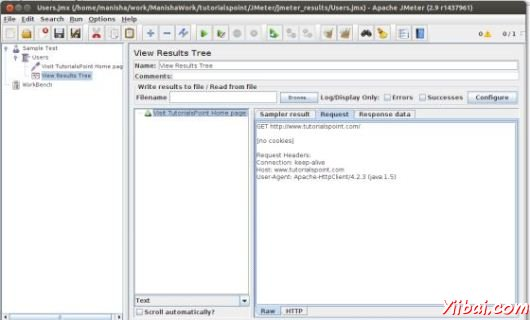
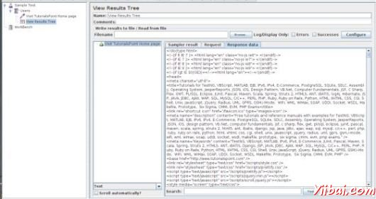

# JMeter Web测试计划 - JMeter教程

让我们建立一个简单的测试计划，测试一个网页。我们将编写一个测试计划，使我们可以在Apache [JMeter](http://www.yiibai.com/jmeter)的性能测试一个网页所示页面网址：http://www.yiibai.com/

### 启动JMeter

打开JMeter窗口通过点击 /home/manisha/apache-jmeter-2.9/bin/jmeter.sh。 JMeter窗口会出现如下图：

这是一个JMeter窗口什么都尚未添加。上述窗口的详细信息如下：

*   保持真正的测试计划，测试计划节点。

*   保持工作台节点是临时的东西。

### 重命名测试计划

更改测试计划节点的名称，在命名文本框中样品测试。必须改变焦点工作台节点和后台，测试计划节点看名字反映。

### 添加线程组

现在，我们将增加在窗口中的第一个元素。我们将添加一个线程组，这是所有其他元素，如取样器，控制器，监听的占位符。可以配置要模拟的用户数。

在JMeter中所有节点的元素被添加使用上下文菜单。想增加一个子元素节点，右击该元素。选择合适的选项添加。

右键单击 Sample Test(our Test Plan )&gt; Add&gt; Threads(Users)&gt; Thread Group. 将添加线程组，根据测试计划（样品测试）节点。

作为用户，我们将其命名线程组。对于我们这个元素是指用户访问的TutorialsPoint主页。

### ADD采样器

现在，我们必须在我们的线程组（用户）添加一个采样。添加线程组做得比较早，这一次我们将开启的线程组（用户）节点的上下文菜单中通过右击并选择 Add &gt; Sampler&gt; HTTP请求选项，我们将添加HTTP请求采样。

这将添加一个空的HTTP请求采样线程组（用户）节点下。让我们配置此节点元素：

*   名称：我们将改变名称，以反映我们要实现的动作是什么。我们将它命名为访问TutorialsPoint首页

*   服务器名称或IP：在这里，我们必须键入Web服务器的名称。在我们的例子中，它是www.yiibai.com。 （包含http://部分不被写入，这仅仅是的服务器的名称或IP）

*   协议：保持空白，这里默认使用HTTP协议。

*   路径：键入路径为/（斜线）。这意味着访问服务器的根页。

### 添加侦听器

我们将添加一个侦听器。让我们添加查看结果树监听线程组（用户）节点下。这将确保采样的结果将可查看该监听节点元素。打开上下文菜单上点击右键选择Add &gt; Listener &gt; View Results Tree选项添加监听线程组（用户）。  

### 运行此测试计划

现在所有的设置，让我们来执行测试计划。随着线程组的配置（用户），我们保留了它所有默认值。这意味着JMeter的执行采样一次。这将是像一个单一的用户只有一次。

这是类似的，喜欢的用户通过浏览器访问的网页，只有在这里，我们正在通过JMeter的采样。使用 Run &gt; Start 选项，我们将执行测试计划。

Apache JMeter的的要求我们在实际测试开始之前，在磁盘文件保存测试计划。这是很重要的，如果我们要运行的测试计划，一遍又一遍。如果说通过单击“No ”选项，不保存，它将运行而不进行保存。

### 查看输出

我们已经保持了设置的线程组作为单个线程（这意味着只有一个用户）和循环时间（这意味着只运行一次），因此，我们将得到单一交易中查看结果树监听的结果。

上述结果的详细信息如下：

*   针对名称访问TutorialsPoint首页绿色表示成功。

*   JMeter已存储了所有的头和由Web服务器发送响应，并准备向我们展示了在许多方面。

*   第一个标签是采样结果。它显示的JMeter的数据以及由Web服务器返回的数据。

*   第二个选项卡的请求，其中示出所有的数据作为请求的一部分被发送到Web服务器。

*   最后一个标签是响应数据。听者在此选项卡中显示了从服务器接收到的数据，因为它是在文本格式。

这仅仅是一个简单的测试计划，执行只有一个请求。但JMeter真实实力，像很多用户都发送发送相同的请求。来测试Web服务器与多个用户，我们将不得不更改线程组（用户）设置。

