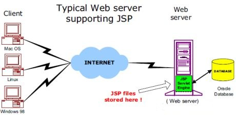

# JSP 结构

网络服务器需要一个JSP引擎，也就是一个容器来处理JSP页面。容器负责截获对JSP页面的请求。本教程使用内嵌JSP容器的Apache来支持JSP开发。

JSP容器与Web服务器协同合作，为JSP的正常运行提供必要的运行环境和其他服务，并且能够正确识别专属于JSP网页的特殊元素。

下图显示了JSP容器和JSP文件在Web应用中所处的位置。

## JSP处理

以下步骤表明了Web服务器是如何使用JSP来创建网页的：

*   就像其他普通的网页一样，您的浏览器发送一个HTTP请求给服务器。
*   Web服务器识别出这是一个对JSP网页的请求，并且将该请求传递给JSP引擎。通过使用URL或者.jsp文件来完成。
*   JSP引擎从磁盘中载入JSP文件，然后将它们转化为servlet。这种转化只是简单地将所有模板文本改用println()语句，并且将所有的JSP元素转化成Java代码。
*   JSP引擎将servlet编译成可执行类，并且将原始请求传递给servlet引擎。
*   Web服务器的某组件将会调用servlet引擎，然后载入并执行servlet类。在执行过程中，servlet产生HTML格式的输出并将其内嵌于HTTP response中上交给Web服务器。
*   Web服务器以静态HTML网页的形式将HTTP response返回到您的浏览器中。
*   最终，Web浏览器处理HTTP response中动态产生的HTML网页，就好像在处理静态网页一样。

以上提及到的步骤可以用下图来表示：

一般情况下，JSP引擎会检查JSP文件对应的servlet是否已经存在，并且检查JSP文件的修改日期是否早于servlet。如果JSP文件的修改日期早于对应的servlet，那么容器就可以确定JSP文件没有被修改过并且servlet有效。这使得整个流程与其他脚本语言（比如PHP）相比要高效快捷一些。

总的来说，JSP网页就是用另一种方式来编写servlet而不用成为Java编程高手。除了解释阶段外，JSP网页几乎可以被当成一个普通的servlet来对待。

