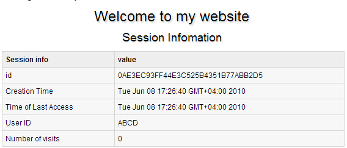
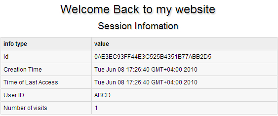

# JSP Session

HTTP是无状态协议，这意味着每次客户端检索网页时，都要单独打开一个服务器连接，因此服务器不会记录下先前客户端请求的任何信息。

有三种方法来维持客户端与服务器的会话：

## Cookies

网络服务器可以指定一个唯一的session ID作为cookie来代表每个客户端，用来识别这个客户端接下来的请求。

这可能不是一种有效的方式，因为很多时候浏览器并不一定支持cookie，所以我们不建议使用这种方法来维持会话。

## 隐藏表单域

一个网络服务器可以发送一个隐藏的HTML表单域和一个唯一的session ID，就像下面这样：

```
<input type="hidden" name="sessionid" value="12345">

```

这个条目意味着，当表单被提交时，指定的名称和值将会自动包含在GET或POST数据中。每当浏览器发送一个请求，session_id的值就可以用来保存不同浏览器的轨迹。

这种方式可能是一种有效的方式，但点击&lt;A HREF&gt;标签中的超链接时不会产生表单提交事件，因此隐藏表单域也不支持通用会话跟踪。

## 重写URL

您可以在每个URL后面添加一些额外的数据来区分会话，服务器能够根据这些数据来关联session标识符。

举例来说，http://w3cschool.cc/file.htm;sessionid=12345， session标识符为sessionid=12345，服务器可以用这个数据来识别客户端。

相比而言，重写URL是更好的方式来，就算浏览器不支持cookies也能工作，但缺点是您必须为每个URL动态指定session ID，就算这是个简单的HTML页面。

## session对象

除了以上几种方法外，JSP利用servlet提供的HttpSession接口来识别一个用户，存储这个用户的所有访问信息。

默认情况下，JSP允许会话跟踪，一个新的HttpSession对象将会自动地为新的客户端实例化。禁止会话跟踪需要显式地关掉它，通过将page指令中session属性值设为false来实现，就像下面这样：

```
<%@ page session="false" %>

```

JSP引擎将隐含的session对象暴露给开发者。由于提供了session对象，开发者就可以方便地存储或检索数据。

下表列出了session对象的一些重要方法：

| **方法** | **描述** |
| --- | --- |
| **public Object getAttribute(String name)** |返回session对象中与指定名称绑定的对象，如果不存在则返回null |
| **public Enumeration getAttributeNames()** |返回session对象中所有的对象名称 |
| **public long getCreationTime()** |返回session对象被创建的时间， 以毫秒为单位，从1970年1月1号凌晨开始算起 |
| **public String getId()** |返回session对象的ID |
| **public long getLastAccessedTime()** |返回客户端最后访问的时间，以毫秒为单位，从1970年1月1号凌晨开始算起 |
| **public int getMaxInactiveInterval()** |返回最大时间间隔，以秒为单位，servlet 容器将会在这段时间内保持会话打开 |
| **public void invalidate()** |将session无效化，解绑任何与该session绑定的对象 |
| **public boolean isNew(** |返回是否为一个新的客户端，或者客户端是否拒绝加入session |
| **public void removeAttribute(String name)** |移除session中指定名称的对象 |
| **public void setAttribute(String name, Object value) ** |使用指定的名称和值来产生一个对象并绑定到session中 |
| **public void setMaxInactiveInterval(int interval)** |用来指定时间，以秒为单位，servlet容器将会在这段时间内保持会话有效 |

## JSP Session应用

这个例子描述了如何使用HttpSession对象来获取创建时间和最后一次访问时间。我们将会为request对象关联一个新的session对象，如果这个对象尚未存在的话。

```
<%@ page import="java.io.*,java.util.*" %>
<%
   // 获取session创建时间
   Date createTime = new Date(session.getCreationTime());
   // 获取最后访问页面的时间
   Date lastAccessTime = new Date(session.getLastAccessedTime());

   String title = "Welcome Back to my website";
   Integer visitCount = new Integer(0);
   String visitCountKey = new String("visitCount");
   String userIDKey = new String("userID");
   String userID = new String("ABCD");

   // 检测网页是否由新的访问用户
   if (session.isNew()){
      title = "Welcome to my website";
      session.setAttribute(userIDKey, userID);
      session.setAttribute(visitCountKey,  visitCount);
   }
   visitCount = (Integer)session.getAttribute(visitCountKey);
   visitCount = visitCount + 1;
   userID = (String)session.getAttribute(userIDKey);
   session.setAttribute(visitCountKey,  visitCount);
%>
<html>
<head>
<title>Session Tracking</title>
</head>
<body>
<center>
<h1>Session Tracking</h1>
</center>
<table border="1" align="center">
<tr bgcolor="#949494">
   <th>Session info</th>
   <th>Value</th>
</tr>
<tr>
   <td>id</td>
   <td><% out.print( session.getId()); %></td>
</tr>
<tr>
   <td>Creation Time</td>
   <td><% out.print(createTime); %></td>
</tr>
<tr>
   <td>Time of Last Access</td>
   <td><% out.print(lastAccessTime); %></td>
</tr>
<tr>
   <td>User ID</td>
   <td><% out.print(userID); %></td>
</tr>
<tr>
   <td>Number of visits</td>
   <td><% out.print(visitCount); %></td>
</tr>
</table>
</body>
</html>

```

试着访问http://localhost:8080/main.jsp ，第一次运行时将会得到如下结果：



再次访问，将会得到如下结果：



## 删除Session数据

当处理完一个用户的会话数据后，您可以有如下选择：

*   **移除一个特定的属性：**

    调用public void removeAttribute(String name)  方法来移除指定的属性。

*   **删除整个会话：**

    调用public void invalidate() 方法来使整个session无效。

*   **设置会话有效期：**

    调用 public void setMaxInactiveInterval(int interval)  方法来设置session超时。

*   **登出用户：**

    支持servlet2.4版本的服务器，可以调用 logout()方法来登出用户，并且使所有相关的session无效。

*   **配置web.xml文件：**

    如果使用的是Tomcat，可以向下面这样配置web.xml文件：

```
  <session-config>
    <session-timeout>15</session-timeout>
  </session-config>

```

超时以分钟为单位，Tomcat中的默认的超时时间是30分钟。

Servlet中的getMaxInactiveInterval( ) 方法以秒为单位返回超时时间。如果在web.xml中配置的是15分钟，则getMaxInactiveInterval( ) 方法将会返回900。
