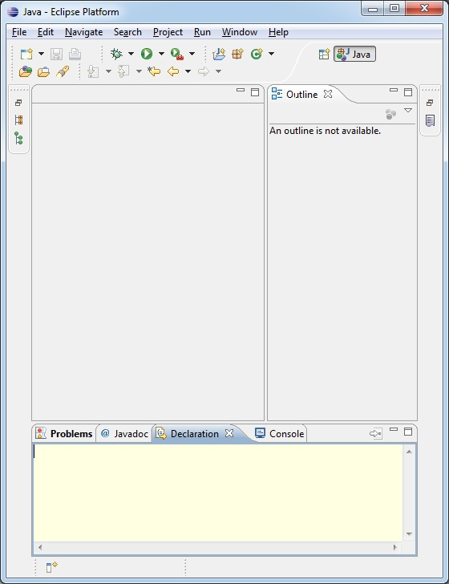
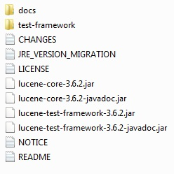

# Lucene环境设置 - Lucene教程

## 环境设置

本教程将指导如何准备一个开发环境，开始与Spring框架工作。本教程还将教如何安装JDK，Tomcat和Eclipse在机器上在设置Spring框架之前：

## 第1步 - 安装Java开发工具包(JDK)：

可以从OracleJava网站上找到最新版本的SDK：Java SE下载。发现有说明在下载的文件中说明处理安装JDK，按照说明安装和配置设置的指示。最后，设置PATH和JAVA_HOME环境变量指的是分别包含java和javac，通常java_install_dir/bin和java_install_dir目录。

如果运行的是Windows，并安装了JDK在 C:jdk1.6.0_15，就必须执行以下C: autoexec.bat。

```
set PATH=C:jdk1.6.0_15in;%PATH%
set JAVA_HOME=C:jdk1.6.0_15

```

另外如果在Windows NT/2000/XP中，也可以在“我的电脑”，选择“属性”，然后“高级”，然后环境变量单击鼠标右键。更新PATH的值，然后按OK按钮。

在Unix（Solaris和Linux等），如果SDK安装在/usr/local/jdk1.6.0_15并且使用的是C shell，把下列内容放入.cshrc文件。

```
setenv PATH /usr/local/jdk1.6.0_15/bin:$PATH
setenv JAVA_HOME /usr/local/jdk1.6.0_15

```

另外，如果使用的集成开发环境（IDE）像Borland公司的JBuilder，Eclipse或IntelliJ IDEA或Sun ONE Studio，那么编译并运行一个简单的程序，以确认该IDE知道安装Java，否则需要为IDE做适当的设置。

## 第2步 - 安装Eclipse IDE

在本教程中的所有示例使用Eclipse IDE。所以建议你应该在计算机上安装最新版本的 Eclipse。

要安装Eclipse IDE，请从 [http://www.eclipse.org/downloads/](http://www.eclipse.org/downloads/) 上下载最新的 Eclipse 可执行文件并安装，解压缩二进制分发到一个方便的位置。例如，在C： Eclipse在Windows上，或在Linux/Unix的 /usr/local/eclipse，最后设置PATH变量恰当即可。

Eclipse可以通过在Windows计算机上执行以下命令来启动，或者可以简单地双击 eclipse.exe

```
 %C:eclipseeclipse.exe

```

Eclipse可以通过执行在Unix（Solaris和Linux等）机器下面的命令来启动：

```
$/usr/local/eclipse/eclipse

```

成功启动后，如果一切正常那么就应该显示如下结果：



## 第3步 - 安装Lucene框架库

现在，如果一切正常，那么就可以继续设的Lucene框架。以下是简单的步骤下载并在机器上安装Lucene框架。

*   选择是否要在Windows或UNIX上安装Lucene，然后进行下一个步骤下载 .zip 文件适用于Windows，以及 .tz 文件适用在 Unix 中。

*   从下载合适版本的Lucene的框架二进制文件 [http://archive.apache.org/dist/lucene/java/](http://archive.apache.org/dist/lucene/java/).

*   在写这篇教程的时候，下载lucene-3.6.2.zip在Windows机器上，当解压缩下载的文件，它会给出里面的目录结构在 C:lucene-3.6.2 如下。



会发现所有的Lucene库在C:lucene-3.6.2 目录。确保在这个目录上设置CLASSPATH变量正确，否则会在运行应用程序时出现问题。如果使用的是 Eclipse 则不需要设置 CLASSPATH，因为所有的设置已通过Eclipse进行。

最后一步完成后，就可以开始Lucene的第一个例子，在下一章中将看到。

