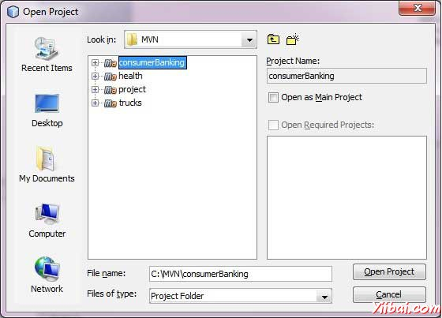
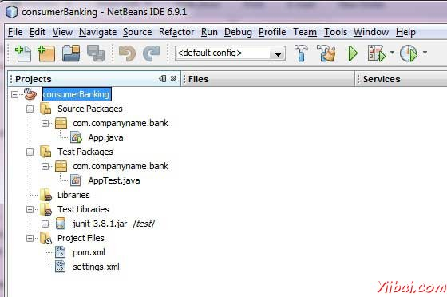
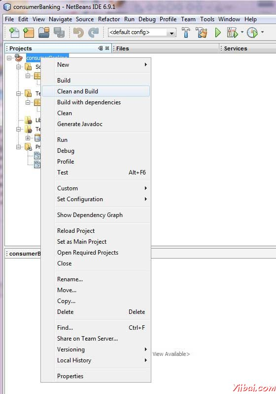

# NetBeans IDE集成Maven - Maven教程

NetBeans6.7更新版本已经内置对Maven支持。如遇以前的版本，Maven插件在插件管理器中可用。我们正在使用NetBeans在这个例子中使用6.9。

在NetBeans一些特点如下

*   您可以从NetBeans运行Maven目标。

*   您可以可以查看Maven命令的输出使用其自己的控制台在NetBeans里面​​。

*   你可以更新maven的依赖关系的IDE。

*   您可以启动Maven从内部的NetBeans版本。

*   NetBeans不依赖自动管理基于Maven的pom.xml。

*   NetBeans解决Maven的依赖关系从它的工作空间，而不需要安装到本地Maven仓库（需要依赖项目在同一个工作区）。

*   NetBeans自动下载需要的依赖和源从远程Maven仓库。

*   NetBeans提供向导，用于创建新的Maven项目及pom.xml

*   NetBeans提供一个Maven资源库浏览器，使您可以查看您的本地存储库和注册的外部Maven仓库。

下面的例子将帮助您充分利用NetBeans的集成和Maven的好处。

## 打开NetBeans Maven项目

*   打NetBeans.

*   选择 File Menu &gt; Open Project 选项.

*   选择项目的位置，使用Maven在那里创建了一个项目。我们已经创建一个Java项目consumerBanking。看到Maven创建项目，看看如何创建使用Maven项目。



现在，你可以看到Maven项目在NetBeans。看看consumerBanking项目库和测试库。可以看到，NetBeans的增加了Maven的依赖关系到它的构建路径。



## 建立在NetBeans Maven项目

现在，它使用NetBeans的Maven来构建项目。

*   右键点击consumerBanking项目打开上下文菜单。

*   选择清理并生成可选项



Maven将开始建设该项目。你可以看到在NetBeans控制台输出

```
NetBeans: Executing 'mvn.bat -Dnetbeans.execution=true clean install'
NetBeans:      JAVA_HOME=C:Program FilesJavajdk1.6.0_21
Scanning for projects...
------------------------------------------------------------------------
Building consumerBanking
   task-segment: [clean, install]
------------------------------------------------------------------------
[clean:clean]
[resources:resources]
[WARNING] Using platform encoding (Cp1252 actually)
to copy filtered resources, i.e. build is platform dependent!
skip non existing resourceDirectory C:MVNconsumerBankingsrcmain
esources
[compiler:compile]
Compiling 2 source files to C:MVNconsumerBanking    argetclasses
[resources:testResources]
[WARNING] Using platform encoding (Cp1252 actually)
to copy filtered resources, i.e. build is platform dependent!
skip non existing resourceDirectory C:MVNconsumerBankingsrc    est
esources
[compiler:testCompile]
Compiling 1 source file to C:MVNconsumerBanking    arget    est-classes
[surefire:test]
Surefire report directory: C:MVNconsumerBanking    argetsurefire-reports

-------------------------------------------------------
 T E S T S
-------------------------------------------------------
Running com.companyname.bank.AppTest
Tests run: 1, Failures: 0, Errors: 0, Skipped: 0, Time elapsed: 0.023 sec

Results :

Tests run: 1, Failures: 0, Errors: 0, Skipped: 0

[jar:jar]
Building jar: C:MVNconsumerBanking    argetconsumerBanking-1.0-SNAPSHOT.jar
[install:install]
Installing C:MVNconsumerBanking    argetconsumerBanking-1.0-SNAPSHOT.jar
to C:UsersGB3824.m2
epositorycomcompanynameankconsumerBanking
1.0-SNAPSHOTconsumerBanking-1.0-SNAPSHOT.jar
------------------------------------------------------------------------
BUILD SUCCESSFUL
------------------------------------------------------------------------
Total time: 9 seconds
Finished at: Thu Jul 19 12:57:28 IST 2012
Final Memory: 16M/85M
------------------------------------------------------------------------

```

## 在NetBeans中运行的应用程序

现在，右键点击App.java。选择Run档选项。你会看到在NetBeans控制台的结果。

```
NetBeans: Executing 'mvn.bat -Dexec.classpathScope=runtime 
-Dexec.args=-classpath %classpath com.companyname.bank.App 
-Dexec.executable=C:Program FilesJavajdk1.6.0_21injava.exe 
-Dnetbeans.execution=true process-classes 
org.codehaus.mojo:exec-maven-plugin:1.1.1:exec'
NetBeans:      JAVA_HOME=C:Program FilesJavajdk1.6.0_21
Scanning for projects...
------------------------------------------------------------------------
Building consumerBanking
   task-segment: [process-classes, 
   org.codehaus.mojo:exec-maven-plugin:1.1.1:exec]
------------------------------------------------------------------------
[resources:resources]
[WARNING] Using platform encoding (Cp1252 actually) 
to copy filtered resources, i.e. build is platform dependent!
skip non existing resourceDirectory C:MVNconsumerBankingsrcmain
esources
[compiler:compile]
Nothing to compile - all classes are up to date
[exec:exec]
**Hello World!**
------------------------------------------------------------------------
BUILD SUCCESSFUL
------------------------------------------------------------------------
Total time: 1 second
Finished at: Thu Jul 19 14:18:13 IST 2012
Final Memory: 7M/64M
------------------------------------------------------------------------
```

