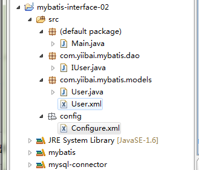

# Mybatis接口注解 - MyBatis教程

在上一章中，我们已经搭建了 myeclipse,mybatis,mysql 的开发环境，并且实现了 mybatis 的一个简单的查询。要注意的是，这种方式是用 SqlSession 实例来直接执行已映射的 SQL 语句：

session.selectOne("com.yiibai.mybatis.models.UserMapper.getUserByID", 1)，但是还有比这更简单的方法，而且是更好的方法，使用合理描述参数和SQL语句返回值的接口(比如：IUser.class)，这样现在就可以至此那个更简单，更安全的代码，没有容易发生的字符串文字和转换的错误，下面是详细过程:

### 1、创建一个接口：IUser，并在其中声明对应的操作方法

在 src 源码目录下创建一个包：com.yiibai.mybatis.dao，并建立接口类 IUser 及一个方法, 在方法上面，我们使用了一个 SQL注释，内容如下：

```
package com.yiibai.mybatis.dao;

import org.apache.ibatis.annotations.Select;

import com.yiibai.mybatis.models.User;
/**
 * @author yiibai.com
 */
public interface IUser {
     @Select("select * from user where id= #{id}")
     public User getUserByID(int id);
}
```

请注意，这里面代码有一个方法名 getUserByID 必须与 User.xml 里面配置的 select 的 id 对应(&lt;select id="getUserByID")同名。

### 2、创建对应映射接口 SQL 语句

首先配置 MyBatis 所需的数据连接文件，这里创建一个文件： src/config/Configure.xml ，其内容如下：

```
<?xml version="1.0" encoding="UTF-8"?>
<!DOCTYPE configuration PUBLIC "-//mybatis.org//DTD Config 3.0//EN"
"http://mybatis.org/dtd/mybatis-3-config.dtd">
<configuration>
    <typeAliases>
        <typeAlias alias="User" type="com.yiibai.mybatis.models.User" />
    </typeAliases>

    <environments default="development">
        <environment id="development">
            <transactionManager type="JDBC" />
            <dataSource type="POOLED">
                <property name="driver" value="com.mysql.jdbc.Driver" />
                <property name="url" value="jdbc:mysql://127.0.0.1:3306/test" />
                <property name="username" value="root" />
                <property name="password" value="" />
            </dataSource>
        </environment>
    </environments>

    <mappers>
        <!-- // power by http://www.yiibai.com -->
        <mapper resource="com/yiibai/mybatis/models/User.xml" />
    </mappers>
</configuration>
```

在包：com.yiibai.mybatis.models 下创建一个 User.java 类文件，与上一节中 User 类代码相同，这里只是拷贝过来，User.java 具体的内容如下：

```
package com.yiibai.mybatis.models;

public class User {
    private int id;
    private String name;
    private String dept;
    private String phone;
    private String website;

    public String getWebsite() {
        return website;
    }
    public void setWebsite(String website) {
        this.website = website;
    }
    public int getId() {
        return id;
    }
    public void setId(int id) {
        this.id = id;
    }
    public String getName() {
        return name;
    }
    public void setName(String name) {
        this.name = name;
    }
    public String getDept() {
        return dept;
    }
    public void setDept(String dept) {
        this.dept = dept;
    }
    public String getPhone() {
        return phone;
    }
    public void setPhone(String phone) {
        this.phone = phone;
    }

}

```

与 User.java 对应的 XML 配置文件：User.xml 内容如下所示（注：在这一小节小，此功能用不上）：

```
<?xml version="1.0" encoding="UTF-8"?>
<!DOCTYPE mapper PUBLIC "-//mybatis.org//DTD Mapper 3.0//EN" 
"http://mybatis.org/dtd/mybatis-3-mapper.dtd">

<mapper namespace="com.yiibai.mybatis.models.UserMapper">
    <select id="getUserByID" parameterType="int" resultType="User">
        select * from `user` where id = #{id}
    </select>
</mapper>
```

这里要注意的是，IUser.java 有一个方法名 getUserByID 必须与 User.xml 里面配置的 select 的 id 对应(<select id="getUserByID")同名。

### 3、测试接口映射

我们在 src 这个目录下创建一个类：Main.java，用来测试整个配置和程序运行结果，有关 Main.java 的代码详细内容如下：

```
名字：New name, 所属部门：Tech, 主页：http://www.yiibai.com
```

最后补充，整个工程 mybatis-interface-02 的结构如下图所示：



**注意：**最后还有一个重要说明， 需要导入两个 jar 库：mysql-connector 和 mybatis3.jar。在上一小节中，有介绍怎么创建用户库。

