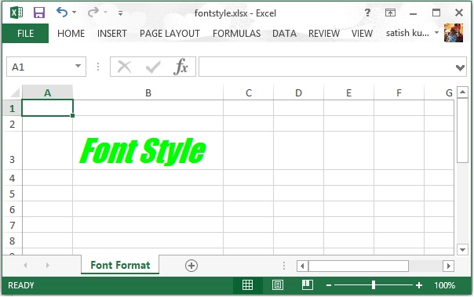
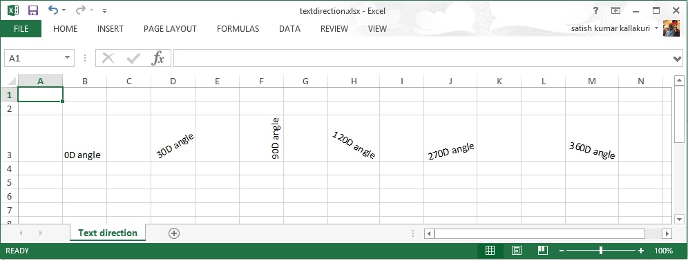

# Apache POI字体/Fonts - POI教程

本章介绍如何设置不同的字体，应用样式，并在Excel电子表格中显示的方向不同角度的文字。

每个系统附带一个很大的字体如 Arial, Impact, Times New Roman,等字体集合也可以用新的字体更新，如果需要的话。同样也有各种风格，其中的字体可以显示，例如，粗体，斜体，下划线，删除线等。

## 字体和字体样式

下面的代码用于特定的字体和样式应用于一单元格的内容。

```
import java.io.File;
import java.io.FileOutputStream;
import org.apache.poi.hssf.util.HSSFColor;
import org.apache.poi.xssf.usermodel.XSSFCell;
import org.apache.poi.xssf.usermodel.XSSFCellStyle;
import org.apache.poi.xssf.usermodel.XSSFFont;
import org.apache.poi.xssf.usermodel.XSSFRow;
import org.apache.poi.xssf.usermodel.XSSFSheet;
import org.apache.poi.xssf.usermodel.XSSFWorkbook;
public class FontStyle 
{
   public static void main(String[] args)throws Exception 
   {
      XSSFWorkbook workbook = new XSSFWorkbook(); 
      XSSFSheet spreadsheet = workbook.createSheet("Fontstyle");
      XSSFRow row = spreadsheet.createRow(2);
      //Create a new font and alter it.
      XSSFFont font = workbook.createFont();
      font.setFontHeightInPoints((short) 30);
      font.setFontName("IMPACT");
      font.setItalic(true);
      font.setColor(HSSFColor.BRIGHT_GREEN.index);
      //Set font into style
      XSSFCellStyle style = workbook.createCellStyle();
      style.setFont(font);
      // Create a cell with a value and set style to it.
      XSSFCell cell = row.createCell(1);
      cell.setCellValue("Font Style");
      cell.setCellStyle(style);
      FileOutputStream out = new FileOutputStream(
      new File("fontstyle.xlsx"));
      workbook.write(out);
      out.close();
      System.out.println(
      "fontstyle.xlsx written successfully");
   }
}

```

让我们保存上面的代码在一个名为FontStyle.java文件。从命令提示符编译并执行它如下。

```
$javac FontStyle.java
$java FontStyle

```

它生成一个名为fontstyle.xlsx在当前目录中的Excel文件并显示在命令提示符处键入以下输出。

```
fontstyle.xlsx written successfully

```

fontstyle.xlsx文件如下所示。



## 文字方向

在这里，可以学习如何设置不同角度的文本方向。通常单元格的内容以水平方式显示，由左到右，并在00角;但是可以使用下面的代码来旋转文本的方向(如果需要的话)。

```
import java.io.File;
import java.io.FileOutputStream;
import org.apache.poi.xssf.usermodel.XSSFCell;
import org.apache.poi.xssf.usermodel.XSSFCellStyle;
import org.apache.poi.xssf.usermodel.XSSFRow;
import org.apache.poi.xssf.usermodel.XSSFSheet;
import org.apache.poi.xssf.usermodel.XSSFWorkbook;
public class TextDirection 
{
   public static void main(String[] args)throws Exception 
   {
      XSSFWorkbook workbook = new XSSFWorkbook(); 
      XSSFSheet spreadsheet = workbook.createSheet(
      "Text direction");
      XSSFRow row = spreadsheet.createRow(2);
      XSSFCellStyle myStyle = workbook.createCellStyle();
      myStyle.setRotation((short) 0);
      XSSFCell cell = row.createCell(1);
      cell.setCellValue("0D angle");
      cell.setCellStyle(myStyle);
      //30 degrees
      myStyle=workbook.createCellStyle();
      myStyle.setRotation((short) 30);
      cell = row.createCell(3);
      cell.setCellValue("30D angle");
      cell.setCellStyle(myStyle);
      //90 degrees
      myStyle=workbook.createCellStyle();
      myStyle.setRotation((short) 90);
      cell = row.createCell(5);
      cell.setCellValue("90D angle");
      cell.setCellStyle(myStyle);
      //120 degrees
      myStyle=workbook.createCellStyle();
      myStyle.setRotation((short) 120);
      cell = row.createCell(7);
      cell.setCellValue("120D angle");
      cell.setCellStyle(myStyle);
      //270 degrees
      myStyle = workbook.createCellStyle();
      myStyle.setRotation((short) 270);
      cell = row.createCell(9);
      cell.setCellValue("270D angle");
      cell.setCellStyle(myStyle);
      //360 degrees
      myStyle=workbook.createCellStyle();
      myStyle.setRotation((short) 360);
      cell = row.createCell(12);
      cell.setCellValue("360D angle");
      cell.setCellStyle(myStyle);
      FileOutputStream out = new FileOutputStream(
      new File("textdirection.xlsx"));
      workbook.write(out);
      out.close();
      System.out.println( 
      "textdirection.xlsx written successfully");
   }
}

```

保持TextDirectin.java文件上面的代码，然后编译并从命令提示符如下执行它。

```
$javac TextDirection.java
$java TextDirection

```

这将编译和执行，以生成一个名为textdirection.xlsx在当前目录中的Excel文件并显示在命令提示符处键入以下输出。

```
textdirection.xlsx written successfully

```

textdirection.xlsx文件如下所示。



