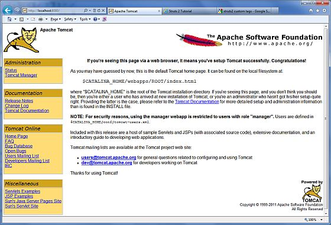

# Servlet 环境设置

开发环境是您可以开发、测试、运行 Servlet 的地方。

就像任何其他的 Java 程序，您需要通过使用 Java 编译器 **javac** 编译 Servlet，在编译 Servlet 应用程序后，将它部署在配置的环境中以便测试和运行。

这个开发环境设置包括以下步骤：

## 设置 Java 开发工具包（Java Development Kit）

这一步涉及到下载 Java 软件开发工具包（SDK，即 Software Development Kit），并适当地设置 PATH 环境变量。

您可以从 Oracle 的 Java 网站下载 SDK：[Java SE Downloads](//www.oracle.com/technetwork/java/javase/downloads/index.html)。

一旦您下载了 SDK，请按照给定的指令来安装和配置设置。最后，设置 PATH 和 JAVA_HOME 环境变量指向包含 java 和 javac 的目录，通常分别为 java_install_dir/bin 和 java_install_dir。

如果您运行的是 Windows，并把 SDK 安装在 C:\jdk1.5.0_20 中，则需要在您的 C:\autoexec.bat 文件中放入下列的行：

```
set PATH=C:\jdk1.5.0_20\bin;%PATH%
set JAVA_HOME=C:\jdk1.5.0_20

```

或者，在 Windows NT/2000/XP 中，您也可以用鼠标右键单击"我的电脑"，选择"属性"，再选择"高级"，"环境变量"。然后，更新 PATH 的值，按下"确定"按钮。

在 Unix（Solaris、Linux 等）上，如果 SDK 安装在 /usr/local/jdk1.5.0_20 中，并且您使用的是 C shell，则需要在您的 .cshrc 文件中放入下列的行：

```
setenv PATH /usr/local/jdk1.5.0_20/bin:$PATH
setenv JAVA_HOME /usr/local/jdk1.5.0_20

```

另外，如果您使用集成开发环境（IDE，即 Integrated Development Environment），比如 Borland JBuilder、Eclipse、IntelliJ IDEA 或 Sun ONE Studio，编译并运行一个简单的程序，以确认该 IDE 知道您安装的 Java 路径。

## 设置 Web 服务器：Tomcat

在市场上有许多 Web 服务器支持 Servlet。有些 Web 服务器是免费下载的，Tomcat 就是其中的一个。

Apache Tomcat 是一款 Java Servlet 和 JavaServer Pages 技术的开源软件实现，可以作为测试 Servlet 的独立服务器，而且可以集成到 Apache Web 服务器。下面是在电脑上安装 Tomcat 的步骤：

*   从 [http://tomcat.apache.org/](//tomcat.apache.org/) 上下载最新版本的 Tomcat。
*   一旦您下载了 Tomcat，解压缩到一个方便的位置。例如，如果您使用的是 Windows，则解压缩到 C:\apache-tomcat-5.5.29 中，如果您使用的是 Linux/Unix，则解压缩到 /usr/local/apache-tomcat-5.5.29 中，并创建 CATALINA_HOME 环境变量指向这些位置。

在 Windows 上，可以通过执行下面的命令来启动 Tomcat：

```
 %CATALINA_HOME%\bin\startup.bat

 or

 C:\apache-tomcat-5.5.29\bin\startup.bat

```

在 Unix（Solaris、Linux 等） 上，可以通过执行下面的命令来启动 Tomcat：

```
$CATALINA_HOME/bin/startup.sh

or

/usr/local/apache-tomcat-5.5.29/bin/startup.sh

```

Tomcat 启动后，可以通过在浏览器地址栏输入 **http://localhost:8080/** 访问 Tomcat 中的默认应用程序。如果一切顺利，那么会显示以下结果：



有关配置和运行 Tomcat 的进一步信息可以查阅应用程序安装的文档，或者可以访问 Tomcat 网站：[http://tomcat.apache.org](//tomcat.apache.org/)。

在 Windows 上，可以通过执行下面的命令来停止 Tomcat：

```
C:\apache-tomcat-5.5.29\bin\shutdown

```

在 Unix（Solaris、Linux 等） 上，可以通过执行下面的命令来停止 Tomcat：

```
/usr/local/apache-tomcat-5.5.29/bin/shutdown.sh

```

## 设置 CLASSPATH

由于 Servlet 不是 Java 平台标准版的组成部分，所以您必须为编译器指定 Servlet 类的路径。

如果您运行的是 Windows，则需要在您的 C:\autoexec.bat 文件中放入下列的行：

```
set CATALINA=C:\apache-tomcat-5.5.29
set CLASSPATH=%CATALINA%\common\lib\servlet-api.jar;%CLASSPATH%

```

或者，在 Windows NT/2000/XP 中，您也可以用鼠标右键单击"我的电脑"，选择"属性"，再选择"高级"，"环境变量"。然后，更新 CLASSPATH 的值，按下"确定"按钮。

在 Unix（Solaris、Linux 等）上，如果您使用的是 C shell，则需要在您的 .cshrc 文件中放入下列的行：

```
setenv CATALINA=/usr/local/apache-tomcat-5.5.29
setenv CLASSPATH $CATALINA/common/lib/servlet-api.jar:$CLASSPATH

```

**注意：**假设您的开发目录是 C:\ServletDevel（在 Windows 上）或 /user/ServletDevel（在 UNIX 上），那么您还需要在 CLASSPATH 中添加这些目录，添加方式与上面的添加方式类似。


