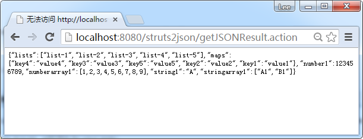

# Struts2和JSON实例 - Struts2教程

在这个Struts2例子，将学习如何通过“struts2-json-plugin.jar”库将对象转换为JSON格式的数据。

## 1\. Action (JSON)

这是一个将被转换成JSON格式的 Action 类。

```
package com.yiibai.common.action;

import java.util.ArrayList;
import java.util.HashMap;
import java.util.List;
import java.util.Map;

import com.opensymphony.xwork2.Action;

public class JSONDataAction{

    private String string1 = "A";
    private String[] stringarray1 = {"A1","B1"};
    private int number1 = 123456789;
    private int[] numberarray1 = {1,2,3,4,5,6,7,8,9};
    private List<String> lists = new ArrayList<String>();
    private Map<String, String> maps = new HashMap<String, String>();

    //no getter method, will not include in the JSON
    private String string2 = "B";

    public JSONDataAction(){
        lists.add("list1");
        lists.add("list2");
        lists.add("list3");
        lists.add("list4");
        lists.add("list5");

        maps.put("key1", "value1");
        maps.put("key2", "value2");
        maps.put("key3", "value3");
        maps.put("key4", "value4");
        maps.put("key5", "value5");
    }

    public String execute() {
               return Action.SUCCESS;
        }

    public String getString1() {
        return string1;
    }

    public void setString1(String string1) {
        this.string1 = string1;
    }

    public String[] getStringarray1() {
        return stringarray1;
    }

    public void setStringarray1(String[] stringarray1) {
        this.stringarray1 = stringarray1;
    }

    public int getNumber1() {
        return number1;
    }

    public void setNumber1(int number1) {
        this.number1 = number1;
    }

    public int[] getNumberarray1() {
        return numberarray1;
    }

    public void setNumberarray1(int[] numberarray1) {
        this.numberarray1 = numberarray1;
    }

    public List<String> getLists() {
        return lists;
    }

    public void setLists(List<String> lists) {
        this.lists = lists;
    }

    public Map<String, String> getMaps() {
        return maps;
    }

    public void setMaps(Map<String, String> maps) {
        this.maps = maps;
    }

}
```

## 3\. struts.xml

要输出JSON数据，需要声明一个包，它扩展“json-default”，会将结果类型转为“json”。

```
<?xml version="1.0" encoding="UTF-8" ?>
<!DOCTYPE struts PUBLIC
"-//Apache Software Foundation//DTD Struts Configuration 2.0//EN"
"http://struts.apache.org/dtds/struts-2.0.dtd">

<struts>

   <constant name="struts.devMode" value="true" />

   <package name="default" namespace="/" extends="json-default">
      <action name="getJSONResult" 
           class="com.yiibai.common.action.JSONDataAction">
              <result type="json" />
      </action>
    </package>

</struts>
```

## 4\. 实例

访问动作URL时，JSONDataAction属性将被转换成JSON格式。

_http://localhost:8080/struts2json/getJSONResult.action

_

JSON 格式 …

```
{
   "lists":["list-1","list-2","list-3","list-4","list-5"],
   "maps":
   {
     "key4":"value4","key3":"value3","key5":"value5","key2":"value2","key1":"value1"
   },
   "number1":123456789,
   "numberarray1":[1,2,3,4,5,6,7,8,9],
   "string1":"A",
   "stringarray1":["A1","B1"]
} 
```

希望这个简单的例子可以了解JSON插件在Struts2是如何工作的有一个总体的思路。不过，还是有很多有用的参数不包括在这里，请务必阅读 [Struts2 JSON插件文档](http://struts.apache.org/docs/json-plugin.html) 以获取更多详细信息。下载源代码(struts2json) – [http://pan.baidu.com/s/1bnv8l9X](http://pan.baidu.com/s/1bnv8l9X)

