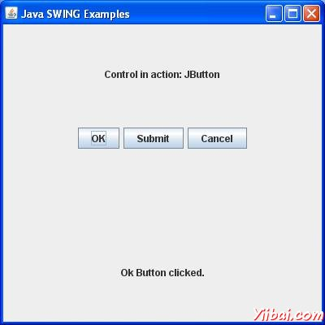

# Swing事件处理 - Swing

## 什么是事件？

一个对象的状态变化被称为事件，即事件描述源状态的变化。事件产生的结果与用户交互的图形用户界面组件。例如，点击一个按钮，移动鼠标，通过键盘输入一个字符，从列表中选择一个项目，滚动页面的活动，使一个事件的发生。

## 事件的类型

事件可以被大致分为两类：

*   **前台事件** - 这些事件需要用户直接互动。在图形用户界面中的图形组件交互的人产生的后果。例如，点击一个按钮，移动鼠标，通过键盘输入一个字符，从列表中选择一个项目，滚动页面等

*   **后台事件** - 这些事件，需要最终用户的交互是已知的作为背景的事件。操作系统的中断，硬件或软件故障，定时器到期时，操作完成的背景事件的例子。

## 事件处理是什么？

事件处理机制，控制的事件，并决定如果一个事件发生时，会发生什么。这种机制被称为事件处理程序，在事件发生时执行的代码。 [Java](http://www.yiibai.com/java)使用代理事件模型来处理事件。该模型定义了标准的机制来生成和处理事件。让我们简要介绍这种模式。

代理事件模型具有以下的主要参与者，即：

*   **源** - 源是一个对象，在该对象上的事件发生。它的处理器提供发生事件的信息来源是可靠的。 JAVA提供与源对象的类。

*   **监听器 **- 它也被称为作为事件handler.Listener是负责产生响应一个事件。从Java实现的角度来看，监听器也是一个对象。等待直到它接收到一个事件监听器。一旦收到事件，监听器进程的事件就返回。

这种方法的好处是，用户界面逻辑完全分开，生成该事件的逻辑。用户界面元素是能够委派的事件处理单独的一段代码。在这个模型中，需要与源对象注册监听使侦听器能够接收事件通知。这是一个有效的方式处理事件，因为这些事件通知只发送给那些监听器要接收他们。

## 参与事件处理的步骤

*   用户单击该按钮时产生该事件。

*   现在有关事件类的对象是自动创建的信息源和事件在同一对象得到填充。

*   事件对象被转发注册监听器类的方法。

*   该方法现在得到执行并返回。

## 要记住的要点有关监听器

*   为了设计一个监听类，我们必须开发一些监听器接口。这些监听器接口预测一些公共的抽象监听器类必须实现的回调方法。

*   如果不执行任何预定义的接口，类不能作为源对象的监听器类。

## 回调方法

这些方法所提供的API提供程序，被定义为应用程序员和应用程序开发者调用。这里的回调方法代表一个事件的方法。在响应一个事件的Java JRE将触发回调方法。所有这些回调方法的监听器接口。

如果一个组件需要一些监听器会听的事件源必须注册自己监听。

## 事件处理例子

选择使用任何编辑器创建以下java程序在 D:/ &gt; SWING &gt; com &gt; yiibai &gt; gui &gt;

SwingControlDemo.java

```
package com.yiibai.gui;

import java.awt.*;
import java.awt.event.*;
import javax.swing.*;

public class SwingControlDemo {

   private JFrame mainFrame;
   private JLabel headerLabel;
   private JLabel statusLabel;
   private JPanel controlPanel;

   public SwingLayoutDemo(){
      prepareGUI();
   }

   public static void main(String[] args){
      SwingLayoutDemo swingLayoutDemo = new SwingLayoutDemo();  
      swingLayoutDemo.showEventDemo();       
   }

   private void prepareGUI(){
      mainFrame = new JFrame("Java SWING Examples");
      mainFrame.setSize(400,400);
      mainFrame.setLayout(new GridLayout(3, 1));

      headerLabel = new JLabel("",JLabel.CENTER );
      statusLabel = new JLabel("",JLabel.CENTER);        

      statusLabel.setSize(350,100);
      mainFrame.addWindowListener(new WindowAdapter() {
         public void windowClosing(WindowEvent windowEvent){
            System.exit(0);
         }        
      });    
      controlPanel = new JPanel();
      controlPanel.setLayout(new FlowLayout());

      mainFrame.add(headerLabel);
      mainFrame.add(controlPanel);
      mainFrame.add(statusLabel);
      mainFrame.setVisible(true);  
   }

   private void showEventDemo(){
      headerLabel.setText("Control in action: Button"); 

      JButton okButton = new JButton("OK");
      JButton submitButton = new JButton("Submit");
      JButton cancelButton = new JButton("Cancel");

      okButton.setActionCommand("OK");
      submitButton.setActionCommand("Submit");
      cancelButton.setActionCommand("Cancel");

      okButton.addActionListener(new ButtonClickListener()); 
      submitButton.addActionListener(new ButtonClickListener()); 
      cancelButton.addActionListener(new ButtonClickListener()); 

      controlPanel.add(okButton);
      controlPanel.add(submitButton);
      controlPanel.add(cancelButton);       

      mainFrame.setVisible(true);  
   }

   private class ButtonClickListener implements ActionListener{
      public void actionPerformed(ActionEvent e) {
         String command = e.getActionCommand();  
         if( command.equals( "OK" ))  {
            statusLabel.setText("Ok Button clicked.");
         }
         else if( command.equals( "Submit" ) )  {
            statusLabel.setText("Submit Button clicked."); 
         }
         else  {
            statusLabel.setText("Cancel Button clicked.");
         }      
      }        
   }
}
```

编译程序，使用命令提示符。到 D:/ &gt; SWING 然后输出以下命令。

```
D:AWT>javac comyiibaiguiSwingControlDemo.java

```

如果没有错误出现，这意味着编译成功。使用下面的命令来运行程序。

```
D:AWT>java com.yiibai.gui.SwingControlDemo

```

验证下面的输出



